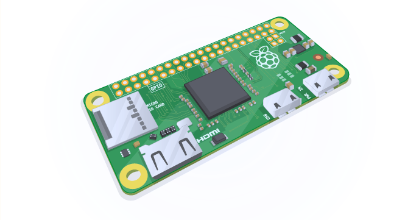

# Raspberry Pi Zero config

## Headless startup
1. First boot configuration
...Create a file to enable ssh connection
```bash
    cd /media/<user>/boot
    touch ssh
```
* In `config.txt`, add `dtoverlay=dwc2` at the end of the file
* In `cmdline.txt`, insert `modules-load=dwc2,g_ether` just after `rootwait`. Be careful with the spaces.
* Create a file named `wpa_supplicant.conf` with the following content to automatically connect to a wifi network
```bash
    country=FR
    ctrl_interface=DIR=/var/run/wpa_supplicant GROUP=netdev
    update_config=1

    network={
        ssid="your_ssid"
        scan_ssid=1
        psk="your password"
        key_mgmt=WPA-PSK
        id_str="AP1" # name what you want. important to defines /etc/network/interfaces
    }
```
* Define a static IP for your usb interface in `/etc/network/interfaces`:
```bash
    allow-hotplug usb0
    iface usb0 inet static
        address 192.168.7.2
        netmask 255.255.255.0
        network 192.168.7.0
        broadcast 192.168.7.255
        gateway 192.168.7.1
```
* You can now boot your pi zero in OTG or wireless mode

## Host configuration
* Give your machine the good address:  
```bash
    sudo ifconfig usb0 192.168.7.1
```
* You can now ssh into pi with:
```bash
    ssh pi@192.168.7.2
```
* Enable internet masquerading and routing:  
```bash
    iptables -t nat -A POSTROUTING -o eth0 -j MASQUERADE
    echo 1 > /proc/sys/net/ipv4/ip_forward
```
* On the pi you should now be able to ping google.com. If not:
```bash
    sudo route add -net default gw 192.168.7.1
```

## Install all the stuff on the pi
* Update:
```bash
    sudo apt-get -y update && sudo apt-get -y upgrade && sudo apt-get -y dist-upgrade
```
* Packages:
```bash
    sudo apt-get install vim git tmux hostapd dnsmasq python-dev python-pip python-gpiozero python3-gpiozero
```

## PI Zero simultaneous AP & Client modes
* Command-line wifi connection:
```bash
    sudo wpa_supplicant -B iwlan0 -c/etc/wpa_supplicant/wpa_supplicant.conf
    sudo dhclient wlan0
```
*  Create a file called `/etc/udev/rules.d/70-persistent-net.rules` which contains the following:
```bash
    SUBSYSTEM=="ieee80211", ACTION=="add|change", ATTR{macaddress}=="YOUR MAC ADDRESS", KERNEL=="phy0", \
    RUN+="/sbin/iw phy phy0 interface add ap0 type __ap", \
    RUN+="/bin/ip link set ap0 address YOUR MAC ADDRESS"
```
* Append the following at the end of `etc/dnsmasq.conf`
```bash
    interface=lo,ap0
    no-dhcp-interface=lo,wlan0
    bind-interfaces
    server=8.8.8.8
    domain-needed
    bogus-priv
    dhcp-range=192.168.10.50,192.168.10.150,12h
```
* Append the following at the end of `etc/network/interfaces`
```bash
    auto lo
    auto ap0
    auto wlan0
    iface lo inet loopback

    allow-hotplug ap0
    iface ap0 inet static
        address 192.168.10.1
        netmask 255.255.255.0
        hostapd /etc/hostapd/hostapd.conf
    
    allow-hotplug wlan0
    iface wlan0 inet manual
        wpa-roam /etc/wpa_supplicant/wpa_supplicant.conf
    iface wlan0 inet dhcp
```
* Create `/etc/hostapd/hostapd.conf` with the following:
```bash
    ctrl_interface=/var/run/hostapd
    ctrl_interface_group=0
    interface=ap0
    driver=nl80211
    ssid=YOUR SSID
    hw_mode=g
    channel=6
    ignore_broadcast_ssid=0
    # SECURITY
    auth_algs=1
    wpa=2
    #wpa_psk=
    wpa_passphrase=YOUR PASSPHRASE
    wpa_key_mgmt=WPA-PSK
    wpa_pairwise=CCMP
    rsn_pairwise=CCMP
```
* Modify `/etc/default/hostapd` like so:
```bash
    DAEMON_CONF="/etc/hostapd/hostapd.conf"
```
* You're done


